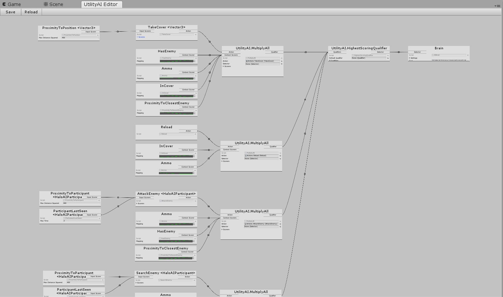

# UtilityAI
Bare-bones utility ai implementation for [Unity3d](https://unity3d.com).

Features:
- One asset per agent type shared by all agents
- Very fast
- Simple to expand and maintain
- This library is small and simple and can be a basis for your own implementation

## Screenshots



## Getting Started
Unzip the repository to your Unity /Assets oder any subfolder. Create a new Brain asset by right clicking in the project explorer, click Create/UnityAI/Brain. Double-click the Brain. The editor will open.

By default, there won't be any Actions, ContextualScorers, ..., so you need to add some in code. Here is a short and senseless example to show you the general structure.

```cs
using System;
using System.Collections.Generic;
using UtilityAI;

// Per agent instance; Shared piece of memory between the AI character and the Brain
[Serializable]
public class TestContext : IAIContext {
    public TestAgent agent;
    // Add things the Brain needs to know here, like a list of known enemies or potential cover positions
    public List<Vector3> somePositions;
}

// Add this component to the AI character
public class TestAgent : MonoBehaviour, IAIContextProvider {
    public Brain brain; // Assign this in the editor; One Brain is a "type" of agent, so shared by multiple agents

    AI ai; // Instance connecting the AI character with its Brain
    TestContext context;

    void Start() {
        context = new TestContext() {
            agent = this
        };

        ai = new AI(brain);

#if UNITY_EDITOR
        // Add hook so the debugger show the agents state when you select it
        var debuggerHook = context.agent.gameObject.AddComponent<AIDebuggingHook>();
        debuggerHook.ai = ai;
        debuggerHook.contextProvider = this;
#endif
    }

    void Update() {
        // In real code you would update this every N milliseconds
        UpdateContext();

        ai.Process(this);
    }

    void UpdateContext() {
         // In real code you would scan for enemies here (Physics.OverlapSphere) or compute cover positions via raycasts 

        somePositions.Clear();
        if (Random.Range(0f, 1f) > 0.5f)
            return;

        somePositions.Add(transform.position + Vector3.left);
        somePositions.Add(transform.position + Vector3.right);
    }

    public IAIContext GetContext() {
        return context;
    }

    // Callbacks for the Actions
    public void Jump() {
        transform.position += Vector3.up;
    }

    public void SetPosition(Vector3 pos) {
        transform.position = pos;
    }
}

public class JumpAction : Action<TestContext> {
    public override void Execute(TestContext context) {
        context.agent.Jump();
    }

    public override void Stop(TestContext context) {
    }
}

public class SetPositionAction : ActionWithInputs<TestContext, Vector3> {
    public override void Execute(TestContext context) {
        var pos = GetBest(context, context.somePositions); // Evaluate the best input using the InputScorers attached to the Action
        context.agent.SetPosition(pos);
    }

    public override void Stop(TestContext context) {
    }
}

// All scorers must return a value between 0 and 1, 0 meaning worst or none, 1 meaning best or all

public class HasSomePositions : ContextualScorer<TestContext> {
    protected override float RawScore(TestContext context) {
        return context.somePositions.Count > 0 ? 1 : 0;
    }
}

public class RandomInput : InputScorer<Vector3> {
    public override float Score(IAIContext context, Vector3 position) {
        return Random.Range(0f, 1f);
    }
}
```

### Prerequisites
Recent Unity version (2017.4.26f1 or later).

## License
This project is licensed under the MIT License. You cannot sell this software on the Unity Asset Store or any other platform that sells software 
tools for developers. You may use this software in a commercial game.
